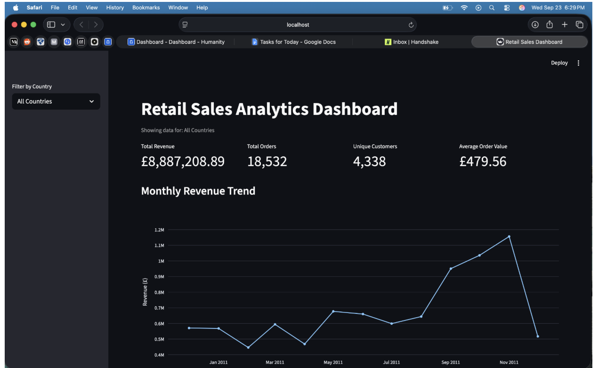

# Retail Sales ETL & Analytics Dashboard



[View the Live Dashboard](https://angel-retail-sales-analytics.streamlit.app)

An end-to-end retail analytics project that extracts and cleans transactional sales data, loads it into MySQL, analyzes it with SQL, and displays business insights through an interactive Streamlit dashboard.

## Project Overview

This project analyzes online retail transaction data using a complete data pipeline:

**Excel Dataset → Python ETL → Cleaned CSV → MySQL → SQL Analysis → Streamlit Dashboard**

The goal of the project is to demonstrate how raw business data can be transformed, stored, queried, and visualized in an interactive analytics application.

## Features

- ETL pipeline built with Python and Pandas
- MySQL database integration
- SQL-based business analysis
- Interactive Streamlit dashboard
- Country-level filtering
- Total revenue tracking
- Total order tracking
- Unique customer analysis
- Average order value
- Monthly revenue trends
- Top products by revenue
- Top countries by revenue
- Top customers by revenue
- Revenue analysis by day of week

## Tech Stack

- Python
- Pandas
- MySQL
- SQLAlchemy
- PyMySQL
- Streamlit
- Plotly
- python-dotenv
- Excel / CSV

## Project Structure

```text
retail-sales-analytics/
├── assets/
│   └── dashboard.png
├── dashboard/
│   └── app.py
├── data/
│   ├── cleaned/
│   └── raw/
├── sql/
│   └── analysis.sql
├── src/
│   ├── extract.py
│   ├── transform.py
│   └── load.py
├── .gitignore
├── README.md
└── requirements.txt
